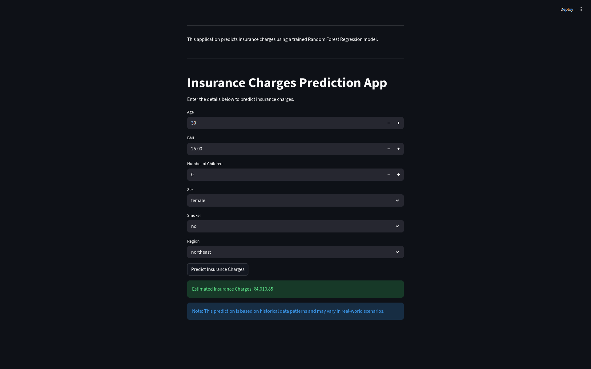

# 🏥 Insurance Charges Prediction | Machine Learning Deployment

**Live Application:** [https://insurance-charges-prediction-vasraj273.streamlit.app](https://insurance-charges-prediction-vasraj273.streamlit.app)

## 📌 Business Context
For health insurance companies, accurately forecasting medical costs is critical for pricing premiums and managing risk. This project aims to help insurance underwriters estimate expected healthcare costs for individuals based on their demographic and lifestyle factors. By leveraging machine learning, companies can move away from rigid pricing tables and towards dynamic, risk-adjusted premium pricing.

## ⚙️ Project Overview
This repository contains an end-to-end machine learning project. It starts with Exploratory Data Analysis (EDA) and model training in a Jupyter Notebook, and concludes with deploying the best-performing model as an interactive web application using Streamlit.

## 📸 Application Preview
[](app_screenshot.png)

## 📊 Model Performance & Selection
I experimented with multiple regression models to find the most accurate predictor of insurance charges. The **Random Forest Regressor** significantly outperformed both the standard and log-transformed Linear Regression models, capturing non-linear relationships in the data much better.

* **Random Forest Regressor (Deployed Model):**
  * **R² Score:** 0.865
  * **RMSE:** $4,576.30
  * **MAE:** $2,550.08
* **Standard Linear Regression:**
  * **R² Score:** 0.783
  * **RMSE:** $5,796.28
* **Log-Transformed Linear Regression:**
  * **R² Score:** 0.606
  * **RMSE:** $7,815.31

## 💡 Key Analytical Insights
* **Smoking is the primary driver of cost:** The model strongly identifies smoking as the factor that increases insurance charges the most.
* **Age & BMI impact:** Costs scale positively with both Age and BMI, especially when combined with the smoking feature.

## 🚀 How to Run the App Locally

If you want to run this application on your local machine, follow these steps:

1. **Clone the repository:**
   ```bash
   git clone https://github.com/vasraj273/insurance-charges-prediction.git
   cd insurance-charges-prediction
   ```

2. **Install the required dependencies:**
   ```bash
   pip install -r requirements.txt
   ```

3. **Run the Streamlit app:**
   ```bash
   streamlit run app.py
   ```
